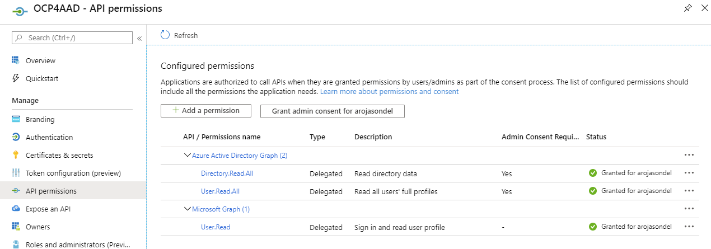
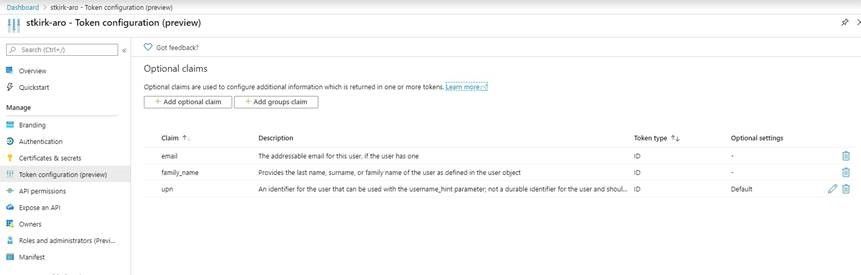
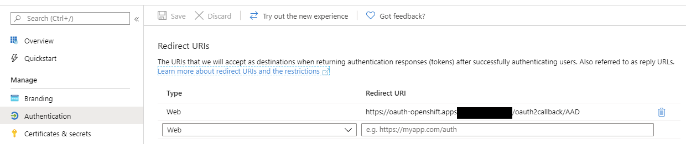
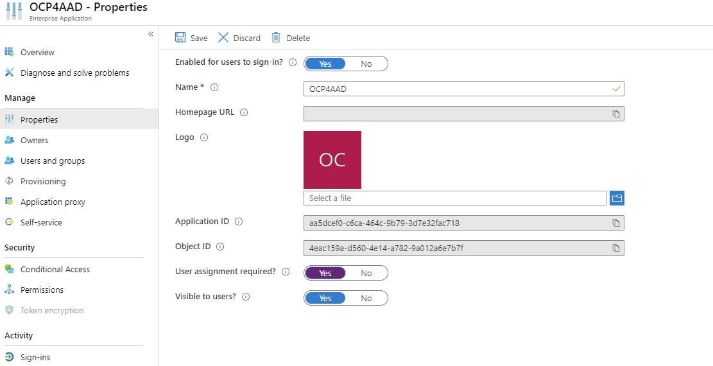
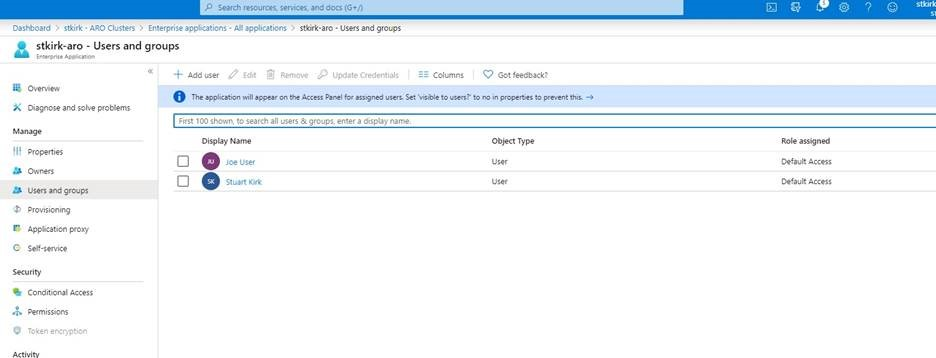
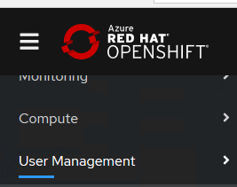
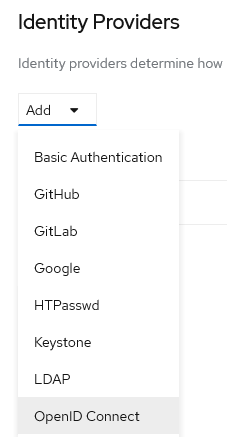
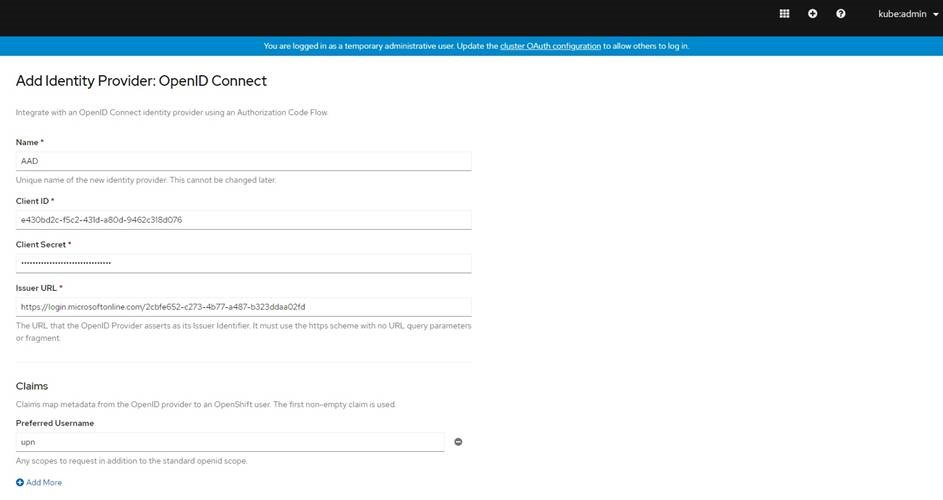
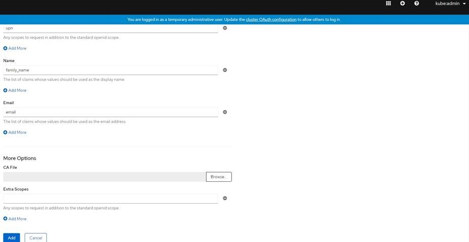

# Configure AAD Integration for an ARO 4.3 Cluster

## Overview

### Service Principal Permissions

You will need to start by [creating or using an existing Service Principal](https://docs.microsoft.com/en-us/azure/openshift/howto-aad-app-configuration#create-an-azure-ad-app-registration) in your AD Tenant that has the following API permissions.  
 
-	Azure Active Directory Graph
    -	Directory.ReadAll
    -	User.ReadAll
-	Microsoft.Graph
    -   User.Read

  

Ensure that you click **"Grant admin consent…"**
 
### Token Configuration

Click on Token configuration (preview) in the SP and enable identities for email, family_name, and upn by clicking "Add optional claim" of type ID for any missing:
  
 

### Configure the Authentication redirect
 
Get the URL of the oauth end point:
 
echo "https://oauth-openshift.apps.$(az aro show -n $CLUSTER -g $RESOURCEGROUP -o tsv
--query clusterProfile.domain)"
 
Click on the "Authentication" tab and enter the Redirect URI returned from the command above:
 
 
 
 ### Restricting Users
 
**OPTIONAL** If you want to restrict ONLY certain users or AD GROUPS to be able to login to your cluster, check **User assignment required**, then add desired users/groups.  

 

 

The complete documentation on how to configure this is [here](https://docs.microsoft.com/en-us/azure/active-directory/develop/howto-restrict-your-app-to-a-set-of-users).

### Configure OpenID
 
In ARO 4.3 you will need to configure an OpenID Connect provider for Azure Active Directory.

1. Get the URL of the cluster web console and navigate to it in a browser:
```bash 
az aro show -n $CLUSTER -g $RESOURCEGROUP -o tsv --query consoleProfile.url
```

2. Use the kubeadmin credentials you received in the [prior steps](README.md).
 
3. Navigate to User Management in the left hand pane:

 
 
4. Click to Add an Identity Provider and choose "OpenID Connect"
 
  
 
5. Set the name to “AAD”.  
 
  

6. Use the ClientID and Secret from the Service Principal in your AD tenant configured earlier.  
 
7. The Issuer URL is formatted as such: https://login.microsoftonline.com/xxxxxxxx-xxxx-xxxx-xxxx-xxxxxxxxxxxx where the xx's represent the format of your AD tenant ID that owns the Service Principal.
 
8. Configure preferred username to be “upn”.
   
9. Set name to `family_name` (Ideally this should be both “given_name family_name” however I am not sure if you put two values if they are concatenated together. This example will only insert the user’s last name). Set email to `email` and choose add.
 
  

**You should now be able to login with AAD credentials.**
