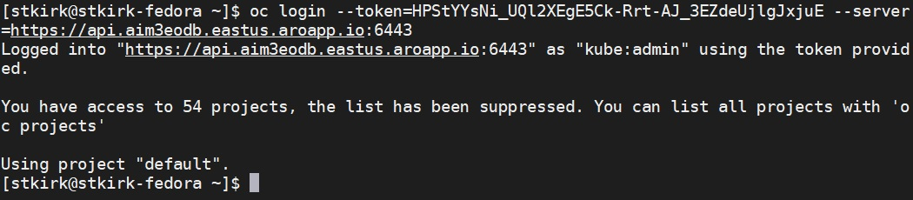
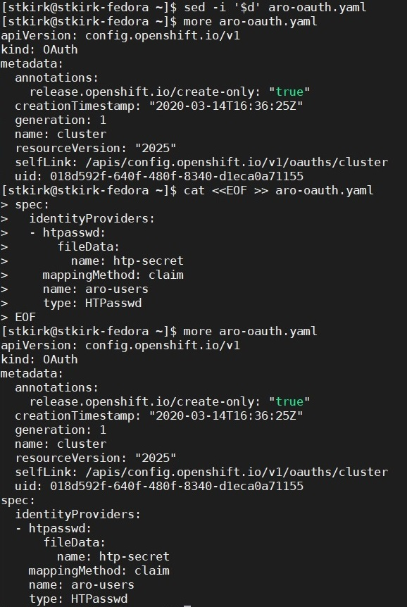

# Configure htpasswd (non-AAD) access to ARO 4.3

Below are the steps to configure a local htpasswd based authentication provider for ARO 4.3. This is useful in proofs-of-concepts to enable multi-user authentication / RBAC / limits without utilizing Azure Active Directory.

Usernames and passwords are stored in a secrets file and are accessed by a configured authentication provider within OpenShift. The steps below outline the process for creating an encrypted secrets file, configuration of the OpenShift authentication provider and subsequent removal of the default *kubeadmin* user.

These instructions presume that you have a **newly provisioned** Azure Red Hat OpenShift cluster running **version 4.3.3 or later** and have the OpenShift CLI installed. This can be obainted from the **origin-clients** RPM or by selecting **Command Line Tools** inside the OpenShift Web Console under the **?** icon in the upper-right corner. In addition you will require the **htpasswd** binary which is typically found in the **httpd-tools** RPM or **apache2-utils** PKG.

---
### Login to the OpenShift CLI
To log in to the OpenShift CLI, you will need to access the token which has been assigned to the default virtual user *kubeadmin*. To obtain this, you must log into the OpenShift Web Console and after clicking the drop down on the *kubeadmin* user in the upper-right corner, select **Copy Login Command**.
Click the **Display Token** link and copy the command entitled **Log in with this token** which begins with **oc**.
Paste this command into your shell to access the OpenShift API as **kubeadmin** using the CLI.
 
 
```bash
oc login --token=<copied-token-hash> --server=https://api.b7z01vg8.eastus.aroapp.io:6443
```
 
### Create the encrypted user database and add multiple users
To create the username:password table, it is identical to creating a .htpasswd file for an httpd server. In the example below, a new password database file is created with three users and then displayed to verify entries for all three users exists.
```bash
htpasswd -c -B aro-users.db admin
htpasswd -B aro-users.db user1
htpasswd -B aro-users.db user2
cat aro-users.db
```
 
### Create the initial authentication provider secrets file and configure a new administrative account
Create the initial authentication provider secrets file for OpenShift using the htpasswd-based database file just created. The **admin** user is also granted full cluster-admin rights, however since the **admin** user has not logged in yet, an error meesage will likely be produced which can safely be ignored.
```bash
oc create secret generic htp-secret --from-file ./aro-users.db -n openshift-config
oc adm policy add-cluster-role-to-user cluster-admin admin --rolebinding-name=cluster-admin
```
 
### Obtain the current OpenShift authentication provider configuration
Obtain the current OpenShift authentication provider configuration file. At this point, there should be no authentication providers configured.
```bash
oc get oauth cluster -o yaml > aro-oauth.yaml
```
### Prepare htpasswd authentication provider
The sample code below will configure the exported YAML configuration to include settings for an htpasswd-based authentication provider using the secrets file which was just created from the htpasswd-based database file.
```bash
sed -i '$d' aro-oauth.yaml
cat <<EOF >> aro-oauth.yaml
spec:
  identityProviders:
  - htpasswd:
      fileData:
        name: htp-secret
    mappingMethod: claim
    name: aro-users
    type: HTPasswd
EOF
```
 
### Update OpenShift with htpasswd authentication provider
Update the OpenShift authentication provider configuration and force-upload the secrets file to force replication.
```bash
oc replace -f ./aro-oauth.yaml 
oc create secret generic htp-secret --from-file htpasswd=./aro-users.db --dry-run -o yaml | oc replace -n openshift-config -f -
```

### Login as Administrator & Verify account
Login as the **admin** user which will be the new administrative/root user for your cluster. If the login and password combination you provide doesn't work, please wait a few minutes and try again as replication may not yet be completed.
```bash
oc login -u admin
oc whoami
oc get users
oc get identity
oc describe clusterrolebinding.rbac cluster-admin
```
 
### Delete the default kubeadmin virtual user (optional)
Once you have verified that you can login as the **admin** user, you can now safely delete the kubeadmin user which was originally provisioned. This is a good security practice. After completing this step, you should now also be able to login to the OpenShift Web Console as the **admin** user and obtain full cluster access.
```bash
oc delete secrets kubeadmin -n kube-system
```
 
### Adding new/subsquent htpasswd users when an existing secrets file exists (optional)
When you wish to add additional users, that is, you've already completed the steps above to create an initial user database you must append the current secrets file stored within OpenShift. Extract the current secrets file to the file aro-users.db, add additional user(s) using htpasswd and replace the secrets file.
```bash
oc extract secret/htp-secret -n openshift-config --to - > aro-users.db
htpasswd -B aro-users.db unclebob
oc create secret generic htp-secret --from-file htpasswd=./aro-users.db --dry-run -o yaml | oc replace -n openshift-config -f -
```
 
### Configure user's full name (optional)
By default, users configured by this method do not have a **"Full Name"** associated with them. To configure the fullName attribute for each user, you will need to obtain the user resource from OpenShift. You can then append the fullName attribute to this file and then replace it.  **Please note the casing of fullName which requires an upper-case 'N'**

### To change a user's full name, they must have either logged into the OpenShift Web Console or CLI prior to executing the commands below.

```bash
oc login -u admin
oc login -u unclebob
oc login -u admin
oc get user unclebob -o yaml > unclebobfullname.yaml
echo "fullName: 'Uncle Bob'" >> unclebobfullname.yaml
oc replace -f unclebobfullname.yaml
oc get users
```
 
