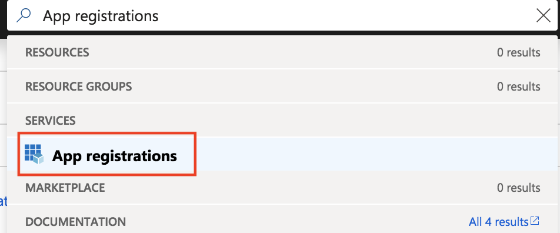
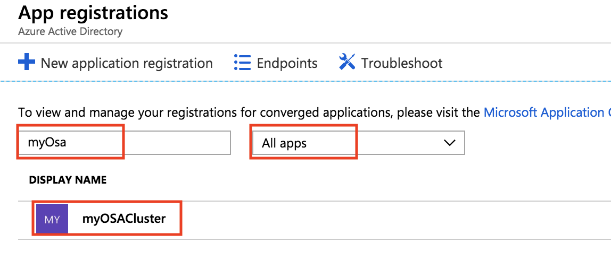

# AAD Application Configuration

OpenShift on Azure will use an AAD Application to allow the cluster to run the authentication against Azure AD.

Part of the `az openshift create` command, it will create and configure one automatically for you but here are some details on how you can manage this part by your self.

## Create a Managed Application Credentials using the CLI

Use the `az ad app create` commnand to create a Managed Application credentials. You will have to pass some settings such as :
- The `display-name` to identify the application.
- The `password` this could be set directly from the `create` command.
- A unique `--identifier-uris` **this have to be unique**.
- A unique `--reply-urls` this have to match the `fqdn` of your cluster. The format have to be : `https://<ClusterName>.<Location>.cloudapp.azure.com/oauth2callback/Azure%20AD`

The following example creates a managed application named `myOSACluster` with the password `myOSACluster` with the following reply url : `https://myOSACluster.eastus.cloudapp.azure.com/oauth2callback/Azure%20AD` and the same unique identifier.

```azurecli-interactive
OSA_AAD_SECRET=MyAw3s0meP@ssw0rd!
OSA_AAD_ID=$(az ad app show --id $OSA_AAD_IDENTIFIER --query appId -o tsv)
OSA_AAD_TENANT=$(az account show --query tenantId -o tsv)
OSA_AAD_REPLY_URL=https://$OSA_CLUSTER_NAME.$LOCATION.cloudapp.azure.com/oauth2callback/Azure%20AD

az ad app create --display-name $OSA_CLUSTER_NAME --key-type Password --password $OSA_AAD_SECRET --identifier-uris $OSA_AAD_REPLY_URL --reply-urls $OSA_AAD_REPLY_URL
```

Snippet Output :

```json
{
  "acceptMappedClaims": null,
  "addIns": [],
  "appId": "57b4f673-af45-1223-1234-efb12fc0cd16",
  ...
  "identifierUris": [
    "https://microsoft.onmicrosoft.com/juosaclitest2"
  ],
  ...
}
```

> Note : Don't use a hard coded value like `OSA_AAD_SECRET=MyAw3s0meP@ssw0rd!` in production. You may want to generate a random secret and copy the value in a safe place.

Put the value of the output's `appId` in the variable `OSA_AAD_ID`, following the example above:

```azurecli-interactive
OSA_AAD_ID=57b4f673-af45-1223-1234-efb12fc0cd16
```

> Note : replace with the actual `appId` you got from the previous command.

## Create an Openshift Cluster on Azure using your own AAD Application

After running the command from the previous section, you can deploy your cluster using those commands :

```azurecli-interactive
OSA_FQDN=$OSA_CLUSTER_NAME.$LOCATION.cloudapp.azure.com
OSA_AAD_TENANT=$(az account show --query tenantId | tr -d '"')

az openshift create --resource-group $OSA_CLUSTER_NAME --name $OSA_CLUSTER_NAME -l $LOCATION --fqdn $OSA_FQDN --aad-client-app-id $OSA_AAD_ID --aad-client-app-secret $OSA_AAD_SECRET --aad-tenant-id $OSA_AAD_TENANT
```

> To get the tenant ID of your current subscription you can run the following command `az account list`

## Verify / Update Reply URLs in AAD app using the portal.

If you already have an existing AAD application you can update the reply URLs in AAD app with FQDN of your newly created OSA cluster.

Do a search for `App registrations` in the search section located at the tep and navigate to it.



Search for your `AAD name` with the `All apps` filter on, and click on it to get more informations.



Click on `Settings` and go in the `Reply URLs` section.

Change or add a value.


> Reminder, this should be using this format : `https://<YOUR_FQDN>/oauth2callback/Azure%20AD`

<!-- LINKS - external -->
[OpenShift CLI]: https://github.com/openshift/origin/releases

<!-- LINKS - internal -->
[az-group-create]: /cli/azure/group#az-group-create
[az-group-delete]: /cli/azure/group#az-group-delete
[azure-cli-install]: /cli/azure/install-azure-cli
[azure-portal]: https://portal.azure.com
