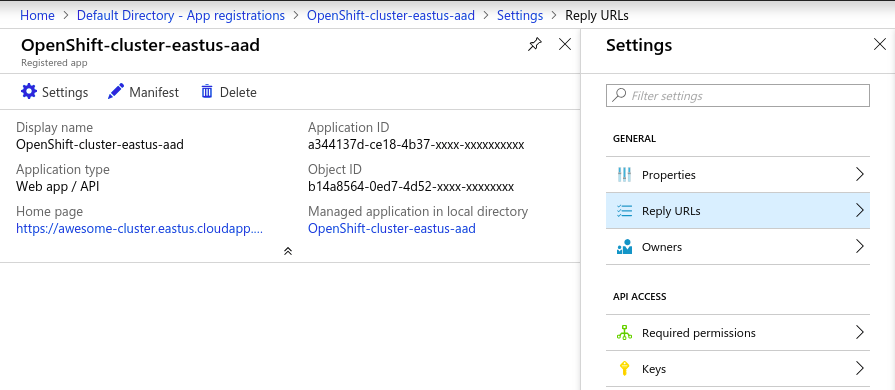
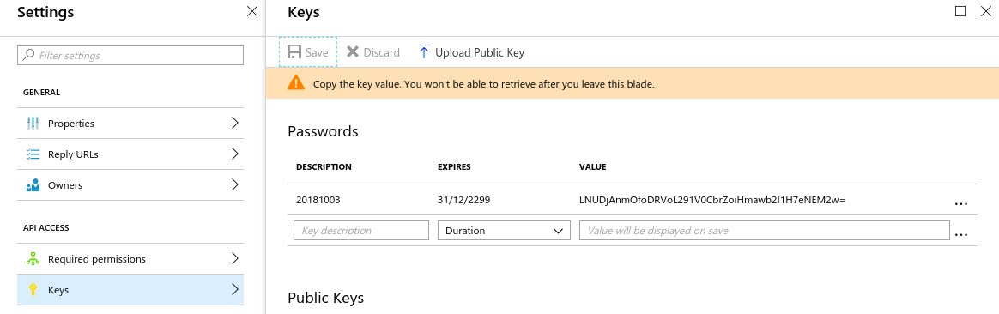

# AAD application configuration

The deployed OpenShift cluster needs a valid AAD application and service principal to call back into the Azure API,
in order to enable AAD authentication. There are a few options here:

* Create application using Azure Portal and configure all values there.

* Create application using CLI and later configure permission in the Azure portal.

* Create application using CLI and approve permission in the Azure portal

To specify your own application for OpenShift to use, add AAD flags to the `az openshift create` command:

```azurecli-interactive
OSA_CLUSTER_NAME=myOSACluster
LOCATION=eastus
OSA_FQDN=$OSA_CLUSTER_NAME.$LOCATION.cloudapp.azure.com

az openshift create --resource-group $OSA_CLUSTER_NAME --name $OSA_CLUSTER_NAME -l $LOCATION --node-count 4 --fqdn $OSA_FQDN --aad-client-app-id $OSA_AAD_ID --aad-client-app-secret $OSA_AAD_SECRET --aad-tenant-id $OSA_AAD_TENANT
```

### Option 1: Create application using Azure portal

Do a search for `App registrations` in the search section located at the top and navigate to it or go to AAD -> app registrations


Press `New application registration` button. Enter details for your application instance and press `Create`.


 Sign-on URL is OpenShift web console URL: `https://awesome-cluster.eastus.cloudapp.azure.com/oauth2callback/Azure%20AD`

Copy value of the `Application ID` fields for `OSA_AAD_ID` from [step 4 above](#Step-4:-Create-OpenShift-cluster). 



`OSA_AAD_SECRET` Value should be set to `Key`, attached to the AAD application. Under same AAD application press `Keys` and create new key:



> Once this key is created and the page is left the value will be hidden. Make sure to store is somewhere safe.

Key value is used for `az openshift create` command `--aad-client-app-secret <aad key value>`

Next you will need to grant set of API permissions for sign-on to work. Under same application press `Required permissions` and `Add`. Set these values:

```
Windows Azure Active Directory:
  Delegated permissions: "Sign in and read user profile"
```

### Option 2: Create application using CLI and later configure permission in the Azure portal

To create application using azure CLI execute:

```azurecli-interactive
OSA_AAD_SECRET=MyAw3s0meP@ssw0rd!
OSA_AAD_REPLY_URL=https://$OSA_CLUSTER_NAME.$LOCATION.cloudapp.azure.com/oauth2callback/Azure%20AD

az ad app create --display-name $OSA_CLUSTER_NAME --key-type Password --password $OSA_AAD_SECRET --identifier-uris $OSA_AAD_REPLY_URL --reply-urls $OSA_AAD_REPLY_URL
```

### Option 3: Create application using CLI and approve permission in the Azure portal

You can create AAD application with all required permissions already configured using this CLI code:

```azurecli-interactive
OSA_AAD_SECRET=MyAw3s0meP@ssw0rd!
OSA_AAD_REPLY_URL=https://$OSA_CLUSTER_NAME.$LOCATION.cloudapp.azure.com/oauth2callback/Azure%20AD
OSA_AAD_ID=$(az ad app create \
        --display-name "$OSA_CLUSTER_NAME" \
        --homepage "$OSA_AAD_REPLY_URL" \
        --identifier-uris "$OSA_AAD_REPLY_URL" \
        --key-type password \
        --password "$OSA_AAD_SECRET" \
        --query appId \
        --reply-urls "$OSA_AAD_REPLY_URL" \
        --required-resource-accesses @- <<'EOF' | tr -d '"'
[
    {
      "resourceAppId": "00000002-0000-0000-c000-000000000000",
      "resourceAccess": [
        {
          "id": "311a71cc-e848-46a1-bdf8-97ff7156d8e6",
          "type": "Scope"
        }
      ]
    }
]
EOF
)
```

## Verify / Update Reply URLs in AAD app

If AAD app was created using `az openshift create` command you can skip this step. If you have an existing Web app/API type AAD application you can update the reply URLs in AAD app with FQDN of your newly created OSA cluster. 

Do a search for `App registrations` in the search section located at the tep and navigate to it.


Search for your `AAD name` with the `All apps` filter on, and click on it to get more informations.


Click on `Settings` and go in the `Reply URLs` section. 

Change or add a value. 


> Reminder, this should be using this format : `https://<YOUR_FQDN>/oauth2callback/Azure%20AD`

