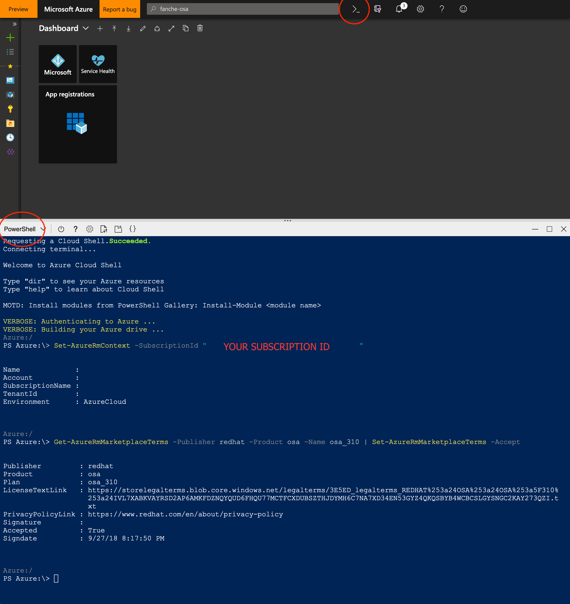
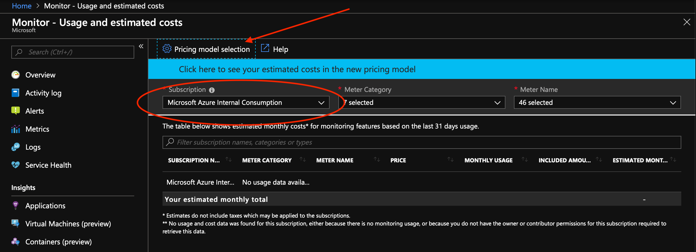
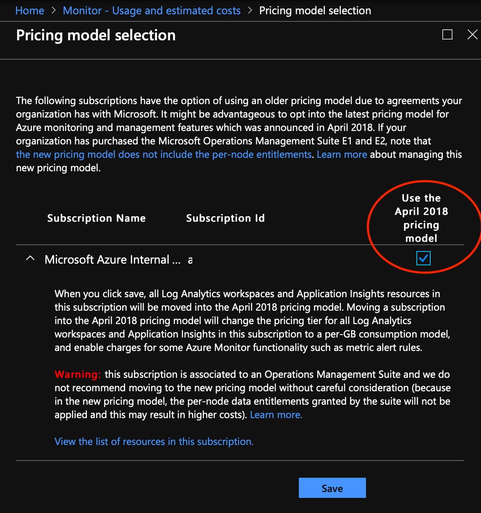
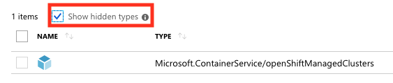

# Known Issues

This page outlines known issues with Managed OpenShift on Azure (OSA), including
workarounds if known.

## Marketplace agreements must be accepted manually

Currently, marketplace agreements for Azure Managed Applications and VM image
must be accepted manually before deploying your first OSA cluster.

- Run a Cloud Shell (PowerShell) session from the Azure portal.



- If you have access to multiple subscriptions, specify the relevant
  subscription ID.

```powershell
Set-AzureRmContext -SubscriptionId "<SUBSCRIPTION_ID>"
```

- Accept marketplace agreements for the Azure Managed Applications and VM image.

```powershell
Get-AzureRmMarketplaceTerms -Publisher redhat -Product osa -Name osa_310 | Set-AzureRmMarketplaceTerms -Accept

Get-AzureRmMarketplaceTerms -Publisher osatesting -Product open-shift-azure-proxy-preview -Name byovnet | Set-AzureRmMarketplaceTerms -Accept

Get-AzureRmMarketplaceTerms -Publisher osatesting -Product open-shift-azure-proxy-preview -Name default | Set-AzureRmMarketplaceTerms -Accept
```

## Providers and features must be registered manually

Currently, the `Microsoft.ContainerService` `openshiftmanagedcluster` feature,
`Microsoft.OperationalInsights` provider and `Microsoft.Solutions` provider must
be registered to your subscription manually before deploying your first OSA
cluster.

- Run a Cloud Shell (PowerShell) session from the Azure portal.

- If you have access to multiple subscriptions, specify the relevant
  subscription ID.

```powershell
Set-AzureRmContext -SubscriptionId "<SUBSCRIPTION_ID>"
```

- Register the Microsoft.ContainerService openshiftmanagedcluster feature.

```powershell
Register-AzProviderFeature -ProviderNamespace Microsoft.ContainerService -FeatureName openshiftmanagedcluster
```

- Wait until the feature is showing RegistrationState `Registered`.

```powershell
Get-AzureRmProviderFeature -ProviderNamespace Microsoft.ContainerService -FeatureName openshiftmanagedcluster | select RegistrationState
```

- Register the Microsoft.OperationalInsights provider.

```powershell
Register-AzureRmResourceProvider -ProviderNamespace Microsoft.OperationalInsights
```

- Wait until the provider is showing RegistrationState `Registered`.

```powershell
Get-AzureRmResourceProvider -ProviderNamespace Microsoft.OperationalInsights | select RegistrationState
```

- Register the Microsoft.Solutions provider.

```powershell
Register-AzureRmResourceProvider -ProviderNamespace Microsoft.Solutions
```

- Wait until the provider is showing RegistrationState `Registered`.

```powershell
Get-AzureRmResourceProvider -ProviderNamespace Microsoft.Solutions | select RegistrationState
```

## First OSA cluster creation in a subscription may fail due to access token error

Currently, the first OSA cluster creation in a subscription may fail with an
error similar to `The access token for this request was issued by the tenant
'...' which is neither the owner tenant '...' nor one of the tenants '...' which
can manage this subscription '...'. The access token must be issued from proper
tenant`.

If this error occurs, it is expected to be a known one-off error.  Delete the
cluster, wait for 15 minutes, and create the cluster again.

## Log Analytics must use April 2018 pricing model

Currently, OSA can only be deployed in subscriptions which use the April 2018
Log Analytics pricing model.  Newly created subscriptions automatically use this
model.

- Confirm you are on the new model using the [Azure Monitoring - Usage and
  estimated costs](https://portal.azure.com/?feature.customportal=false%2F#blade/Microsoft_Azure_Monitoring/AzureMonitoringBrowseBlade/usageAndCosts)
  blade.

- Select your subscription and then click on `Pricing model selection`.



- If available and unchecked, check `Use the April 2018 pricing model` and click
  `Save`.



## May not be possible to retry creation of a failed cluster

Currently, in many circumstances, if creation of a cluster using the `az` CLI
fails, retrying creation will always fail.  In this case, use `az openshift
delete` to delete the failed cluster and attempt to create an entirely new
cluster.

## OpenShift server certificate is untrusted

Note that currently the OpenShift console certificate is untrusted, therefore
when navigating to the console, you will need to manually accept the untrusted
certificate in your browser.

## OpenShift Managed Cluster resource is hidden by default

Currently, the `Microsoft.ContainerService/openShiftManagedClusters` resource
created by the `az` CLI is hidden in the Azure portal.  In the relevant
`Resource group` view, check `Show hidden types` to view the resource.



## Only available cluster update is scale up / scale down

Currently, no modifications are permitted to the
`Microsoft.ContainerService/openShiftManagedClusters` resource after creation,
except for scaling up or down the number of compute nodes.  Currently the
maximum number of compute nodes is limited to 5.

## Limited VM sizes

Currently, Managed OpenShift on Azure only permits use of Azure Standard_D2s_v3
and Standard_D4s_v3 VM sizes.

## Cannot create cluster with FQDNs containing capital letters

Currently, the Azure API accepts cluster creation requests with FQDNs containing
capital letters, but the creation later fails.  Do not include capital letters
in FQDNs.

## OMS Workspace region restrictions

OMS workspace creation is not available in all regions due to capacity constraint and this might further be limited on a per subscription basis. 
As a result of that, OpenShift on Azure will be using one region per sovereignty to maximize chances of successful cluster creation.