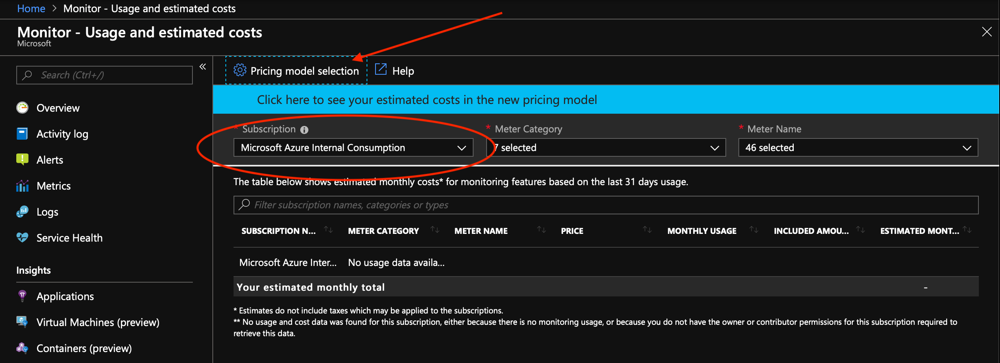
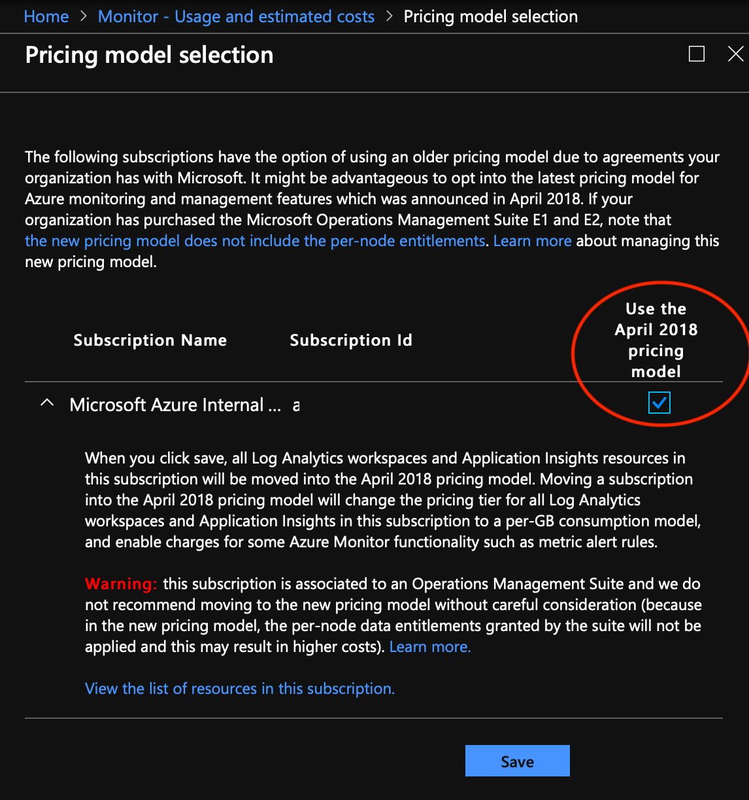
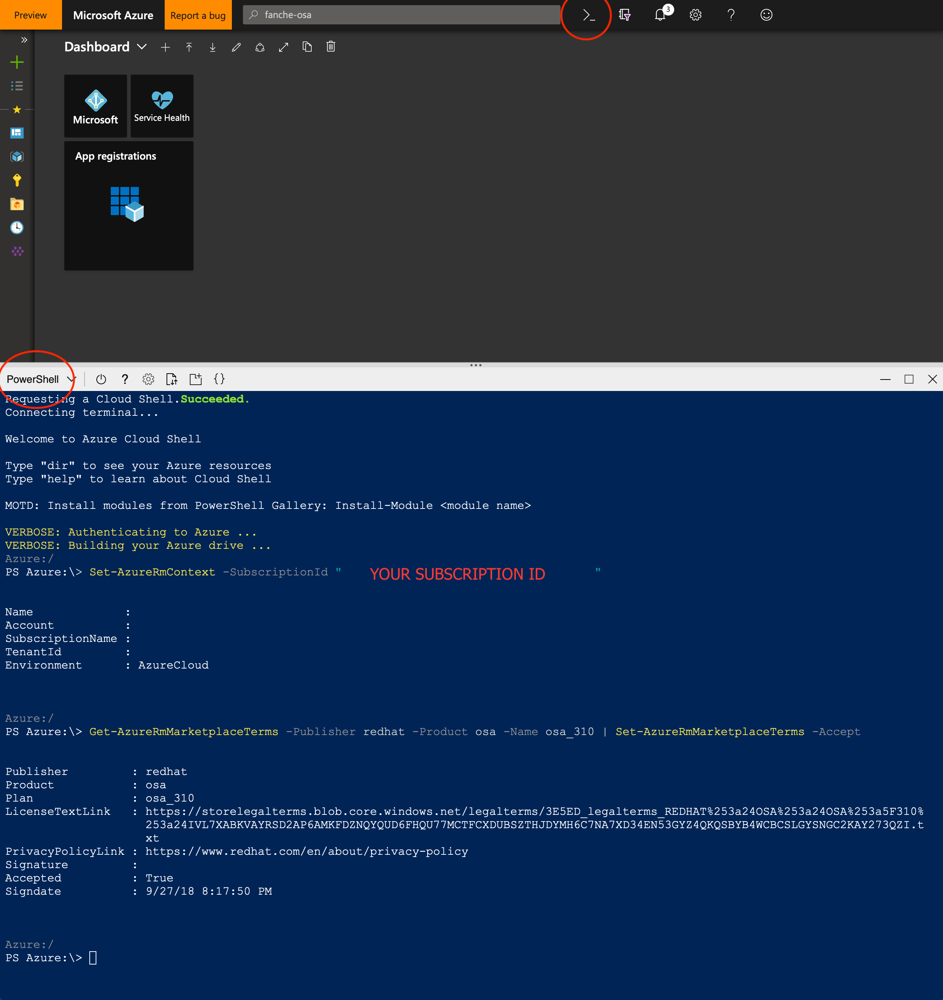

# Known Issues

This document outlines known issues with Managed OpenShift on Azure (OSA), including workarounds if known.

## Log Analytics

### Pricing model

OSA requires the new April 2018 pricing model (if you are not using the new model already) for Log Analytics.

- Confirm you are on the new model using the [Azure Monitoring - Usage and estimated costs](https://portal.azure.com/?feature.customportal=false%2F#blade/Microsoft_Azure_Monitoring/AzureMonitoringBrowseBlade/usageAndCosts) blade.

- Select your subscription and then click on `Pricing model selection`.



- Make sure that `Use the April 2018 pricing model` is checked and saved.



## Accept MarketPlace agreements

Before deploying OSA, marketplace agreements for Azure Managed Applications and Red Hat images will need to be accepted at this time.

- Use Cloud Shell (with PowerShell) inside the portal to accept these agreements.



- Make sure to set subscription to the whitelisted subscription ID.

```powershell
Set-AzureRmContext -SubscriptionId "<SUBSCRIPTION_ID>"
```

- Accept Marketplace terms for Red Hat OpenShift image and Azure Managed Apps.

```powershell
Get-AzureRmMarketplaceTerms -Publisher redhat -Product osa -Name osa_310 | Set-AzureRmMarketplaceTerms -Accept

Get-AzureRmMarketplaceTerms -Publisher osatesting -Product open-shift-azure-proxy-preview -Name byovnet | Set-AzureRmMarketplaceTerms -Accept

Get-AzureRmMarketplaceTerms -Publisher osatesting -Product open-shift-azure-proxy-preview -Name default| Set-AzureRmMarketplaceTerms -Accept
```
