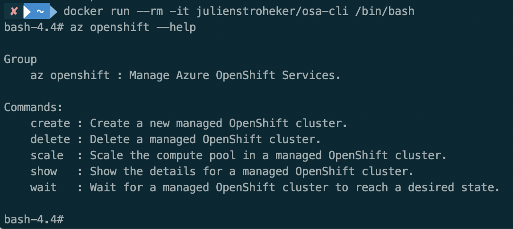
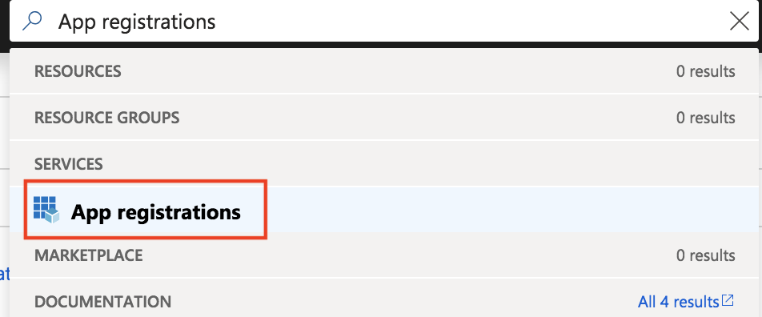
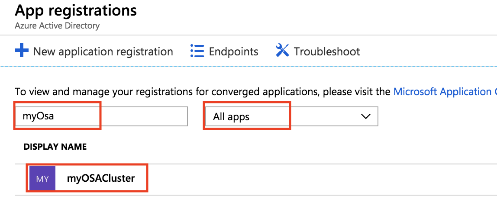
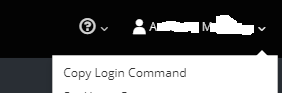

# Quickstart: Deploy a Managed OpenShift cluster

# Prerequisites

In this quickstart, a Managed OpenShift cluster is deployed using the Azure CLI.

OpenShift on Azure is in private preview. For this reason we are using a custom build of the Azure CLI.

To use it, you have to make sure Docker is installed on your machine.

[More information on how to install Docker can be found here.](https://docs.docker.com/install/)

> **Warning** : This CLI support is provided on a best-effort basis. Please open Issues on this repo if you have questions or concerns.

The build of this CLI is under the `julienstroheker/osa-cli` container.

To start using `az`, run `docker run --rm -it julienstroheker/osa-cli /bin/bash`. This command will give you a bash inside the container where the `az openshift` commands are available.

From this bash your should be able to run any `az` commands and the `az openshift` one.



## Step 0: Log in to Azure

The first step will be to authenticate yourself by running the `az login` command. This command will start the authentication flow using you browser. 

If you have access to multiple subscriptions, make sure to use the correct one by running the command `az account list -o table`. Then just validate if the field `isDefault` is equal `True` at the same line of your subscription. 

If not, you can run `az account set -s <SubId>` by remplacing <SubId> with the correct one.

## Step 1: Create a resource group

Create a resource group with the `az group create` command. An Azure resource group is a logical group in which Azure resources are deployed and managed. When you create a resource group, you are asked to specify a location. This location is where your resources run in Azure.

The following example creates a resource group named *myOSACluster* in the *eastus* location.

```azurecli-interactive
OSA_CLUSTER_NAME=myOSACluster
LOCATION=eastus

az group create --name $OSA_CLUSTER_NAME --location $LOCATION
```

Output:

```json
{
  "id": "/subscriptions/00000000-0000-0000-0000-000000000000/resourceGroups/myOSACluster",
  "location": "eastus",
  "managedBy": null,
  "name": "myOSACluster",
  "properties": {
    "provisioningState": "Succeeded"
  },
  "tags": null
}
```

## Step 1: Create a Managed Application Credentials

Use the `az ad app create` commnand to create a Managed Application credentials will allow the cluster to run the authentication against Azure AD. We will have to pass some settings such as :
- The `display-name` to identify the application.
- The `password` this could be set directly from the `create` command.
- A unique `--identifier-uris` **this have to be unique**.
- A unique `--reply-urls` this have to match the `fqdn` of your cluster. The format have to be : `https://<ClusterName>.<Location>.cloudapp.azure.com/oauth2callback/Azure%20AD`

The following example creates a managed application named `myOSACluster` with the password `myOSACluster` with the following reply url : `https://myOSACluster.eastus.cloudapp.azure.com/oauth2callback/Azure%20AD` and the same unique identifier.

```azurecli-interactive
OSA_CLUSTER_NAME=myOSACluster
OSA_AAD_SECRET=MyAw3s0meP@ssw0rd!
OSA_AAD_REPLY_URL=https://$OSA_CLUSTER_NAME.$LOCATION.cloudapp.azure.com/oauth2callback/Azure%20AD
OSA_AAD_IDENTIFIER=$OSA_AAD_REPLY_URL

az ad app create --display-name $OSA_CLUSTER_NAME --key-type Password --password $OSA_AAD_SECRET --identifier-uris $OSA_AAD_IDENTIFIER --reply-urls $OSA_AAD_REPLY_URL
```

Snippet Output :

```json
{
  "acceptMappedClaims": null,
  "addIns": [],
  "appId": "57b4f673-af45-1223-1234-efb12fc0cd16",
  ...
  "identifierUris": [
    "https://microsoft.onmicrosoft.com/juosaclitest2"
  ],
  ...
}
```

## Step 2: Create OpenShift cluster

Use the `az openshift create` command to create an OpenShift cluster. 
The following example creates a cluster named *myOSACluster* with four nodes.

```azurecli-interactive
OSA_FQDN=$OSA_CLUSTER_NAME.$LOCATION.cloudapp.azure.com
OSA_AAD_ID=$(az ad app show --id $OSA_AAD_IDENTIFIER --query appId -o tsv)
OSA_AAD_TENANT=$(az account show --query tenantId | tr -d '"')

az openshift create --resource-group $OSA_CLUSTER_NAME --name $OSA_CLUSTER_NAME -l $LOCATION --node-count 4 --fqdn $OSA_FQDN --aad-client-app-id $OSA_AAD_ID --aad-client-app-secret $OSA_AAD_SECRET --aad-tenant-id $OSA_AAD_TENANT
```
> `OSA_AAD_ID` is the `appId` value from the previous command in Step 2.

> To get the tenant ID of your current subscription you can run the following command `az account list`

After several minutes, the command completes and returns JSON-formatted information about the cluster.

## Step 3: Verify / Update Reply URLs in AAD app

If AAD app was created using Step 1 you can skip this step. If you have an existing Web app/API type AAD application you can update the reply URLs in AAD app with FQDN of your newly created OSA cluster. 

Do a search for `App registrations` in the search section located at the tep and navigate to it.



Search for your `AAD name` with the `All apps` filter on, and click on it to get more informations.



Click on `Settings` and go in the `Reply URLs` section. 

Change or add a value. 


> Reminder, this should be using this format : `https://<YOUR_FQDN>/oauth2callback/Azure%20AD`

## Step 4: Connect to the cluster

After your deployment is done, you should be able to open your browser to the `fqdn` that you choose during the creation of your cluster.

For example : `https://myOSACluster.eastus.cloudapp.azure.com`

> You will have a `NET::ERR_CERT_AUTHORITY_INVALID` error from your browser, you will have to validate the connexion manually.

Click on `Azure AD`


## Step 5: Using OC CLI
Click on the upper right corner (profile name) to get the CLI login information. 



You need the OC CLI which can be downloaded from https://github.com/openshift/origin/releases

> Using MacOS, you can easly install it with homebrew `brew install openshift-cli
`
 
Login using OC CLI by copying the command above:
```
oc login <FQDN> --token=<YOUR_TOKEN>
```


<!-- LINKS - external -->
[OpenShift CLI]: https://github.com/openshift/origin/releases

<!-- LINKS - internal -->
[az-group-create]: /cli/azure/group#az-group-create
[az-group-delete]: /cli/azure/group#az-group-delete
[azure-cli-install]: /cli/azure/install-azure-cli
[azure-portal]: https://portal.azure.com