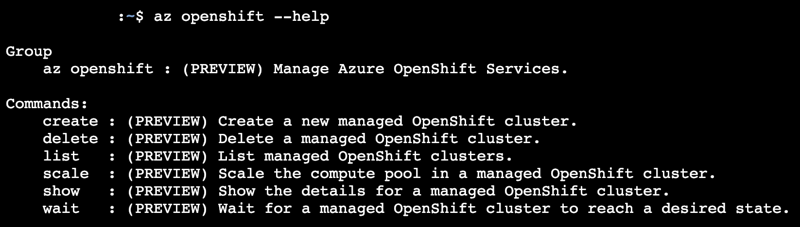
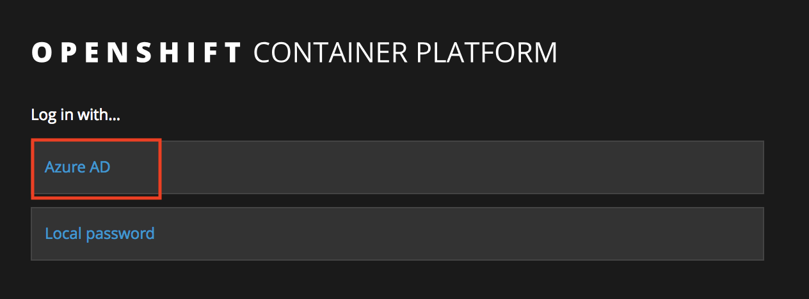

# Quickstart: Deploying a Managed OpenShift on Azure cluster

This quickstart will walk you through deploying a Managed OpenShift on Azure
cluster using the Azure CLI.

**Note:** OpenShift on Azure is not officially supported.  For technical
questions, please open GitHub
[issues](https://github.com/Azure/OpenShift/issues).

## Prerequisites

It is **essential** to follow the following prerequisites before deploying an OSA
cluster for the first time in an Azure subscription.

- Currently, marketplace agreements for Azure Managed Applications and VM image
  must be accepted manually before deploying your first OSA cluster.  Follow the
  instructions in [known
  issues](known-issues.md#marketplace-agreements-must-be-accepted-manually).

- Currently, the `Microsoft.ContainerService` `openshiftmanagedcluster` feature,
  `Microsoft.OperationalInsights` provider and `Microsoft.Solutions` provider
  must be registered to your subscription manually before deploying your first
  OSA cluster.  Follow the instructions in [known
  issues](known-issues.md#providers-and-features-must-be-registered-manually).

- Docker is required to run the preview Azure CLI.  More information on how to
  install Docker can be found [here](https://docs.docker.com/install/).

## Step 1: Install the preview Azure CLI

Currently, OpenShift on Azure requires use of a preview build of the Azure CLI
published in a container image at `julienstroheker/osa-cli`.  It is recommended
to run `docker pull julienstroheker/osa-cli` regularly to get CLI updates.

Pull the preview Azure CLI image and run it to get to a bash prompt where the
`az openshift` commands are available.

```bash
docker pull julienstroheker/osa-cli
docker run --rm -it julienstroheker/osa-cli
az openshift --help
```



## Step 2: Log in to Azure

From the preview Azure CLI image bash prompt, run `az login` to log in to Azure.

```bash
az login
```

If you have access to multiple subscriptions, run `az account set -s
SUBSCRIPTION_ID` to default to the correct subscription.

## Step 3: Create a Managed OpenShift on Azure cluster

Choose a name and Azure location for your Managed OpenShift on Azure cluster.
The fully qualified domain name (FQDN) of your cluster will be
`$CLUSTER_NAME.$LOCATION.cloudapp.azure.com`.  This FQDN must not already be
taken by any Azure virtual machine, otherwise cluster creation will fail.  Note
that there is a [known
issue](known-issues.md#cannot-create-cluster-with-fqdns-containing-capital-letters)
that FQDNs must not contain capital letters.

This walkthrough will create a Managed OpenShift on Azure cluster in a new
resource group with the same name as the cluster, with the default of 4
Standard_D4s_v3 compute nodes.

It follows the `az openshift create` default behaviour of automatically creating
an Azure AD Application for you.  For more details, see [AAD Application
Configuration](aad-application-configuration.md).

It does not enable VNET peering on the cluster's VNET.  For details on how to do
that, see [VNET Peering](vnet-peering.md).

From the preview Azure CLI image bash prompt, run:

```bash
CLUSTER_NAME=myuniqueclustername
LOCATION=eastus
FQDN=$CLUSTER_NAME.$LOCATION.cloudapp.azure.com

az group create --name $CLUSTER_NAME --location $LOCATION

az openshift create --resource-group $CLUSTER_NAME --name $CLUSTER_NAME -l $LOCATION --fqdn $FQDN
```

All being well, after 10-15 minutes `az openshift create` will complete
successfully and return a JSON document containing your cluster details.

## Step 4: Navigate to the OpenShift on Azure cluster console

After `az openshift create` has completed, you should be able to open your
browser and navigate to https://$FQDN/, e.g.
https://myuniqueclustername.eastus.cloudapp.azure.com/.

**Note:** currently the OpenShift console certificate is untrusted, therefore
when navigating to the console, you will need to manually accept the untrusted
certificate in your browser.

To log in to the cluster, click on `Azure AD`.



You should now be logged into the cluster console.


## Step 5: Use the oc CLI

In the cluster console, click the question mark in the upper right corner and
select `Command Line Tools`.  Follow the `Latest Release` link to download and
install the supported oc CLI for Linux, MacOS or Windows.

The same page also has a command of the form `oc login
https://myuniqueclustername.eastus.cloudapp.azure.com --token=<hidden>`.  Click
the copy to clipboard button to copy this command.  Paste it in your terminal to
log in to the cluster using the oc CLI.

## Step 6: Scale up to 5 compute nodes

From the preview Azure CLI image bash prompt, run:

```bash
az openshift scale --resource-group $CLUSTER_NAME --name $CLUSTER_NAME --compute-count 5
```

All being well, after a few minutes `az openshift create` will complete
successfully and return a JSON document containing your cluster details.
