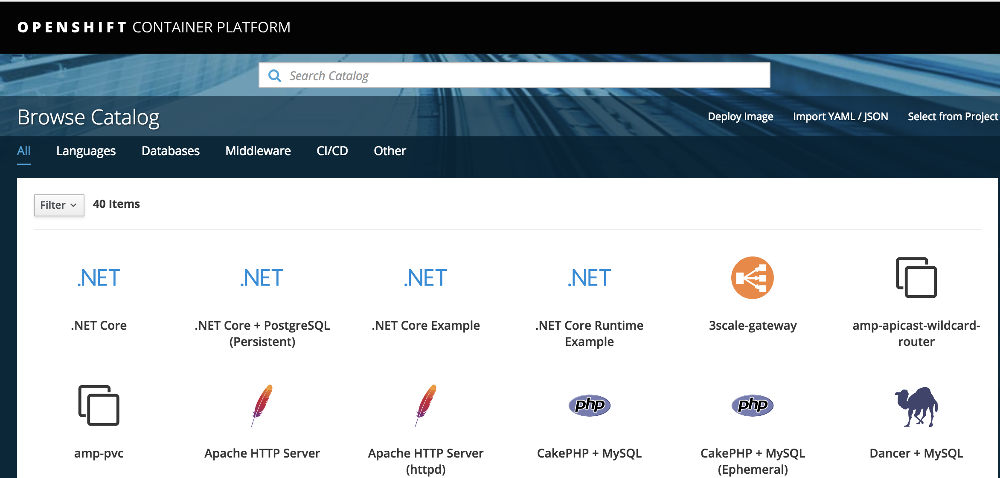

# Quickstart: Deploy a Managed OpenShift cluster

# Prerequisites

In this quickstart, a Managed OpenShift cluster is deployed using the Azure CLI.

OpenShift on Azure is in private preview. For this reason we are using a custom build of the Azure CLI.

To use it, you have to make sure Docker is installed on your machine.

[More information on how to install Docker can be found here.](https://docs.docker.com/install/)

> **Warning** : This CLI is not supported at this time. Please open Issues on this repo if you have questions or concerns.

The build of this CLI is under the `julienstroheker/osa-cli` container.

To start using `az`, run `docker run --rm -it julienstroheker/osa-cli /bin/bash`. This command will give you a bash inside the container where the `az openshift` commands are available.

From this bash your should be able to run any `az` commands and the `az openshift` one.


## Step 0: Log in to Azure

The first step will be to authenticate yourself by running the `az login` command. This command will start the authentication flow using you browser. 

If you have access to multiple subscriptions, make sure to use the correct one by running the command `az account list -o table`. Then just validate if the field `isDefault` is equal `True` at the same line of your subscription. 

If not, you can run `az account set -s <SubId>` by remplacing <SubId> with the correct one.

## Step 1: Register your subscription to the Managed OpenShift Preview

To register your subscription please run the following commmand :

```azurecli-interactive
az feature register --namespace Microsoft.ContainerService -n openshiftmanagedcluster
```

Output :

```json
{
  "id": "/subscriptions/00000000-0000-0000-0000-000000000000/providers/Microsoft.Features/providers/Microsoft.ContainerService/features/openshiftmanagedcluster",
  "name": "Microsoft.ContainerService/openshiftmanagedcluster",
  "properties": {
    "state": "Pending"
  },
  "type": "Microsoft.Features/providers/features"
}
```

To verify the status of the registration :

```azurecli-interactive
az feature show --namespace Microsoft.ContainerService -n openshiftmanagedcluster
```

Make sure you can see the `"state": "Registered"` in the payload before executing the `openshift` commands.

## Step 2: Create a resource group

Create a resource group with the `az group create` command. An Azure resource group is a logical group in which Azure resources are deployed and managed. When you create a resource group, you are asked to specify a location. This location is where your resources run in Azure.

The following example creates a resource group named *myOSACluster* in the *eastus* location.

```azurecli-interactive
OSA_CLUSTER_NAME=myOSACluster
LOCATION=eastus

az group create --name $OSA_CLUSTER_NAME --location $LOCATION
```

Output:

```json
{
  "id": "/subscriptions/00000000-0000-0000-0000-000000000000/resourceGroups/myOSACluster",
  "location": "eastus",
  "managedBy": null,
  "name": "myOSACluster",
  "properties": {
    "provisioningState": "Succeeded"
  },
  "tags": null
}
```

## Step 3: Create a Managed Application Credentials

Use the `az ad app create` commnand to create a Managed Application credentials will allow the cluster to run the authentication against Azure AD. We will have to pass some settings such as :
- The `display-name` to identify the application.
- The `password` this could be set directly from the `create` command.
- A unique `--identifier-uris` **this have to be unique**.
- A unique `--reply-urls` this have to match the `fqdn` of your cluster. The format have to be : `https://<ClusterName>.<Location>.cloudapp.azure.com/oauth2callback/Azure%20AD`

The following example creates a managed application named `myOSACluster` with the password `myOSACluster` with the following reply url : `https://myOSACluster.eastus.cloudapp.azure.com/oauth2callback/Azure%20AD` and the same unique identifier.

```azurecli-interactive
OSA_AAD_SECRET=MyAw3s0meP@ssw0rd!
OSA_AAD_REPLY_URL=https://$OSA_CLUSTER_NAME.$LOCATION.cloudapp.azure.com/oauth2callback/Azure%20AD

az ad app create --display-name $OSA_CLUSTER_NAME --key-type Password --password $OSA_AAD_SECRET --identifier-uris $OSA_AAD_REPLY_URL --reply-urls $OSA_AAD_REPLY_URL
```

Snippet Output :

```json
{
  "acceptMappedClaims": null,
  "addIns": [],
  "appId": "57b4f673-af45-1223-1234-efb12fc0cd16",
  ...
  "identifierUris": [
    "https://microsoft.onmicrosoft.com/juosaclitest2"
  ],
  ...
}
```

## Step 4: Create OpenShift cluster

Use the `az openshift create` command to create an OpenShift cluster. 
The following example creates a cluster named *myOSACluster* with four nodes.


```azurecli-interactive
OSA_FQDN=$OSA_CLUSTER_NAME.$LOCATION.cloudapp.azure.com
OSA_AAD_ID=<appId value from the output above>
OSA_AAD_TENANT=$(az account show --query tenantId | tr -d '"')

az openshift create --resource-group $OSA_CLUSTER_NAME --name $OSA_CLUSTER_NAME -l $LOCATION --node-count 4 --fqdn $OSA_FQDN --aad-client-app-id $OSA_AAD_ID --aad-client-app-secret $OSA_AAD_SECRET --aad-tenant-id $OSA_AAD_TENANT
```
> `OSA_AAD_ID` is the `appId` value from the previous command in Step 2.

> To get the tenant ID of your current subscription you can run the following command `az account list`

> To successfully use AAD application to login into the cluster, you will need to configure API permissions. For more details check [AAD application configuration](#aad-application-configuration)

After several minutes, the command completes and returns JSON-formatted information about the cluster.

## Step 5: Verify / Update Reply URLs in AAD app

If AAD app was created using Step 1 you can skip this step. If you have an existing Web app/API type AAD application you can update the reply URLs in AAD app with FQDN of your newly created OSA cluster. 

Do a search for `App registrations` in the search section located at the tep and navigate to it.


Search for your `AAD name` with the `All apps` filter on, and click on it to get more informations.


Click on `Settings` and go in the `Reply URLs` section. 

Change or add a value. 


> Reminder, this should be using this format : `https://<YOUR_FQDN>/oauth2callback/Azure%20AD`

## Step 6: Connect to the cluster

After your deployment is done, you should be able to open your browser to the `fqdn` that you choose during the creation of your cluster.

For example : `https://myOSACluster.eastus.cloudapp.azure.com`

> You will have a `NET::ERR_CERT_AUTHORITY_INVALID` error from your browser, you will have to validate the connexion manually.

Click on `Azure AD`




## Step 7: Using OC CLI
Click on the upper right corner (profile name) to get the CLI login information. 


You need the OC CLI which can be downloaded from https://github.com/openshift/origin/releases

> Using MacOS, you can easly install it with homebrew `brew install openshift-cli
`
 
Login using OC CLI by copying the command above:
```
oc login <FQDN> --token=<YOUR_TOKEN>
```


## AAD application configuration

The deployed OpenShift cluster needs a valid AAD application and service principal to call back into the Azure API,
in order to enable AAD authentication. There are a few options here:

* Create application using Azure Portal and configure all values there.

* Create application using CLI and later configure permission in the Azure portal.

* Create application using CLI and approve permission in the Azure portal

### Case 1: Create application using Azure portal

Do a search for `App registrations` in the search section located at the tep and navigate to it.


Press `New application registration` button. Enter details for your application instance and press `Create`.


 Sign-on URL is OpenShift web console URL: `https://awesome-cluster.eastus.cloudapp.azure.com/oauth2callback/Azure%20AD`

Copy value of the `Application ID` fields for `OSA_AAD_ID` from [step 4 above](#Step-4:-Create-OpenShift-cluster). 


`OSA_AAD_SECRET` Value should be set to `Key`, attached to the AAD application. Under same AAD application press `Keys` and create new key:


Key value is used for `az openshift create` command `--aad-client-app-secret <aad key value>`

Next you will need to grant set of API permissions for sign-on to work. Under same application press `Required permissions` and `Add`. Set these values:

```
Microsoft Graph:
  Application permissions: Read all groups, Read directory data
  Delegated permissions: Read all groups
Windows Azure Active Directory:
  Delegated permissions: Sign in and read user profile
```

For the permissions to take effect, Azure subscription administrator will need to press `Grant permissions` to approve permission request.

### Case 2: Create application using CLI and later configure permission in the Azure portal

To create application using azure CLI execute:


```azurecli-interactive
OSA_AAD_SECRET=MyAw3s0meP@ssw0rd!
OSA_AAD_REPLY_URL=https://$OSA_CLUSTER_NAME.$LOCATION.cloudapp.azure.com/oauth2callback/Azure%20AD

az ad app create --display-name $OSA_CLUSTER_NAME --key-type Password --password $OSA_AAD_SECRET --identifier-uris $OSA_AAD_REPLY_URL --reply-urls $OSA_AAD_REPLY_URL
```

You will be prompted with the output of the newly created application. After this you will need to configure API permissions for the created application. Follow case 1 from the place, where it speaks about granting set of API permissions for sing-on to work.

### Case 3: Create application using CLI and approve permission in the Azure portal

You can create AAD application with all required permissions already configured using this CLI code:

```azurecli-interactive
OSA_AAD_SECRET=MyAw3s0meP@ssw0rd!
OSA_AAD_REPLY_URL=https://$OSA_CLUSTER_NAME.$LOCATION.cloudapp.azure.com/oauth2callback/Azure%20AD
OSA_AAD_ID=$(az ad app create \
        --display-name "$OSA_CLUSTER_NAME" \
        --homepage "$OSA_AAD_REPLY_URL" \
        --identifier-uris "$OSA_AAD_REPLY_URL" \
        --key-type password \
        --password "$OSA_AAD_SECRET" \
        --query appId \
        --reply-urls "$OSA_AAD_REPLY_URL" \
        --required-resource-accesses @- <<'EOF' | tr -d '"'
[
    {
      "resourceAppId": "00000003-0000-0000-c000-000000000000",
      "resourceAccess": [
        {
          "id": "7ab1d382-f21e-4acd-a863-ba3e13f7da61",
          "type": "Role"
        },
        {
          "id": "5f8c59db-677d-491f-a6b8-5f174b11ec1d",
          "type": "Scope"
        },
        {
          "id": "5b567255-7703-4780-807c-7be8301ae99b",
          "type": "Role"
        },
        {
          "id": "37f7f235-527c-4136-accd-4a02d197296e",
          "type": "Scope"
        }
      ]
    },
    {
      "resourceAppId": "00000002-0000-0000-c000-000000000000",
      "resourceAccess": [
        {
          "id": "311a71cc-e848-46a1-bdf8-97ff7156d8e6",
          "type": "Scope"
        }
      ]
    }
]
EOF
)
```

Now Azure Subscription administrator will need to grant application permissions in Azure portal as described in case 1. 


<!-- LINKS - external -->
[OpenShift CLI]: https://github.com/openshift/origin/releases

<!-- LINKS - internal -->
[az-group-create]: /cli/azure/group#az-group-create
[az-group-delete]: /cli/azure/group#az-group-delete
[azure-cli-install]: /cli/azure/install-azure-cli
[azure-portal]: https://portal.azure.com
