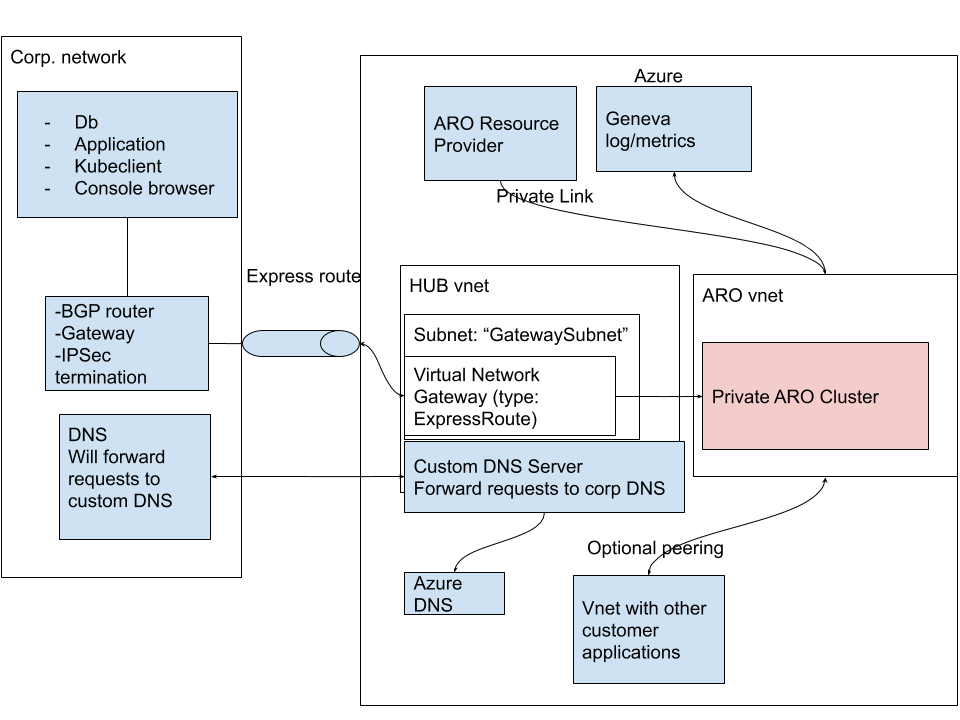
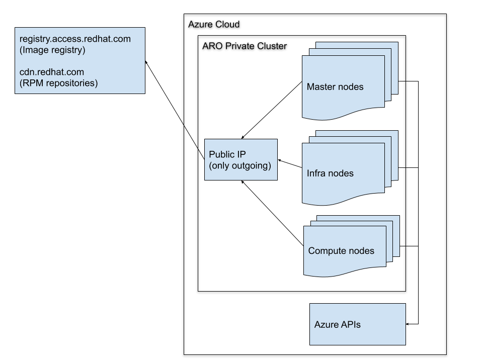

# Create an ARO 3.11 Private Cluster

[!IMPORTANT]
Please note that ARO private clusters are currently only available in private preview in East US. Private preview acceptance is by invitation only. Please be sure to register your subscription before attempting to enable this feature. 

The Azure Red Hat OpenShift team is pleased to release private cluster functionality in private preview. Private clusters do not expose cluster control plane components (such as the API servers) on a public IP address.

The VNet of a private cluster is configurable by customers, allowing them to set up networking to allow peering with other VNets, including ExpressRoute environments. Customers can also configure custom DNS on the VNet in order to integrate with internal services.

## Prerequisites
This feature requires version 2019-10-27-preview of the ARO HTTP API. It is not yet supported in the Azure CLI.

The fields in the following configuration snippet are new and must be included in the cluster configuration. managementSubnetCidr must be within the cluster VNet and is used by Azure to manage the cluster.

```
properties:
 networkProfile:
   managementSubnetCidr: 10.0.1.0/24
 masterPoolProfile:
   apiProperties:
     privateApiServer: true
```

A private cluster can be deployed using the sample scripts provided below. Once the cluster is deployed, execute a “cluster get” and view the properties.FQDN property to determine the private IP address of the OpenShift API server.

The cluster VNet will have been created with permissions so that you can modify it. You can then setup networking to access the VNet (ExpressRoute, VPN, VNet peering) as required for your needs.

If you change the DNS nameservers on the cluster VNet, then you will need to issue an update on the cluster with the properties.RefreshCluster property set to true so that the VMs can be reimaged. This will allow them to pick up the new nameservers.

## Sample Configuration Scripts

### Environment

Fill in the environment variables below as appropriate, using your cluster name, subscription ID, preferred location, etc.

```
export CLUSTER_NAME=
export LOCATION=westcentralus
export TOKEN=$(az account get-access-token --query 'accessToken' -o tsv)
export SUBID=
export TENANT_ID=
export ADMIN_GROUP=
export CLIENT_ID=
export SECRET=
```

### private-cluster.json
Using the environment variables defined above, here is a sample cluster configuration with private cluster enabled.

```
{
   "location": "$LOCATION",
   "name": "$CLUSTER_NAME",
   "properties": {
       "openShiftVersion": "v3.11",
       "networkProfile": {
           "vnetCIDR": "10.0.0.0/8",
           "managementSubnetCIDR" : "10.0.1.0/24"
       },
       "authProfile": {
           "identityProviders": [
               {
                   "name": "Azure AD",
                   "provider": {
                       "kind": "AADIdentityProvider",
                       "clientId": "$CLIENT_ID",
                       "secret": "$SECRET",
                       "tenantId": "$TENANT_ID",
                       "customerAdminGroupID": "$ADMIN_GROUP"
                   }
               }
           ]
       },
       "masterPoolProfile": {
           "name": "master",
           "count": 3,
           "vmSize": "Standard_D4s_v3",
           "osType": "Linux",
           "subnetCIDR": "10.0.0.0/24",
           "privateApiServer": true
       },
       "agentPoolProfiles": [
           {
               "role": "compute",
               "name": "compute",
               "count": 1,
               "vmSize": "Standard_D4s_v3",
               "osType": "Linux",
               "subnetCIDR": "10.0.0.0/24"
           },
           {
               "role": "infra",
               "name": "infra",
               "count": 3,
               "vmSize": "Standard_D4s_v3",
               "osType": "Linux",
               "subnetCIDR": "10.0.0.0/24"
           }
       ],
       "routerProfiles": [
           {
               "name": "default"
           }
       ]
   }
}
```
 ## Deploy a private cluster
```
az group create --name $CLUSTER_NAME --location $LOCATION
 
cat private-cluster.json | envsubst | curl -v -X PUT \
-H 'Content-Type: application/json; charset=utf-8' \
-H 'Authorization: Bearer '$TOKEN'' -d @- \
 https://management.azure.com/subscriptions/$SUBID/resourceGroups/$CLUSTER_NAME/providers/Microsoft.ContainerService/openShiftManagedClusters/$CLUSTER_NAME?api-version=2019-10-27-preview
```

## Diagrams

### Private Cluster Architecture



### Data Flow

)

